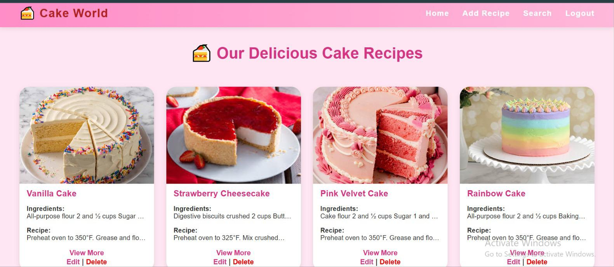

<p align="center">
  
</p>

<h1 align="center">🎂 Cake World – A Flask-Based Cake Recipe Website</h1>

<p align="center">
  <b>A sweet and stylish web application to share, search, and manage your favorite cake recipes.</b>
</p>

<p align="center">
  
  
  
  
  
</p>

---

## 🍰 About the Project
**Cake World** is a responsive and beginner-friendly Flask web application that allows users to:
- Add, edit, view, and delete cake recipes.
- Search for recipes using keywords.
- Upload cake images with a smooth, pastel-pink themed UI.

This project is built with **Flask**, **HTML**, **CSS**, and **SQLite**, keeping simplicity and elegance in mind. Perfect for those learning **Python web development** or building their first full-stack app.

---

## 🌸 Features
- 🍪 Add, update, and delete cake recipes  
- 🍫 Upload and display recipe images  
- 🎀 Beautiful pink pastel theme (fully responsive)  
- 🔍 Search bar for quick filtering  
- 🔒 Login and Register pages  
- ✅ Tested with `pytest` (3/3 tests passed)

---

## 📁 Project Structure
```

cake_world_flask/
│
├── app.py
├── users.db
├── .gitignore
├── LICENSE
├── README.md
│
├── banner.png
│
├── static/
│   ├── style.css
│   └── uploads/
│       ├── VANILLA.jpg
│       ├── Strawberry_Cheesecake.jpeg
│       ├── pink_velvet_cake.jpg
│       └── chocolate-rainbow-cake.jpg
│
├── templates/
│   ├── base.html
│   ├── index.html
│   ├── add.html
│   ├── update.html
│   ├── view_recipe.html
│   ├── search.html
│   ├── login.html
│   └── register.html
│
└── tests/
└── test_app.py

```

---

## ⚙️ Installation & Setup

### 1️⃣ Clone the repository
```bash
git clone https://github.com/Rumaisas-islam/flask-cake-recipe-website.git
cd flask-cake-recipe-website
````

### 2️⃣ Create a virtual environment

```bash
python -m venv venv
```

### 3️⃣ Activate the environment

* **Windows:**

  ```bash
  venv\Scripts\activate
  ```
* **Mac/Linux:**

  ```bash
  source venv/bin/activate
  ```

### 4️⃣ Install dependencies

```bash
pip install flask pytest
```

### 5️⃣ Run the app

```bash
python app.py
```

Then open: 👉 [http://127.0.0.1:5000/](http://127.0.0.1:5000/)

---

## 🧁 Run Tests

To make sure everything works perfectly:

```bash
pytest
```

✅ All tests should pass:

```
3 passed in 0.36s
```

---

## 🌐 Live Preview

Take a quick look at the website design 👇



---

## 📜 License

This project is licensed under the **MIT License** — feel free to use, modify, and share with attribution.

---

## 💖 Author

**Rumaisa Islam**
🌐 [GitHub Profile](https://github.com/Rumaisas-islam)

> “Crafted with ❤️ for dessert lovers and future web developers.”

---

## 🏷️ Tags

`flask` `python` `cake-recipes` `web-development` `html` `css` `bakery` `dessert` `food-website` `recipe-app`
